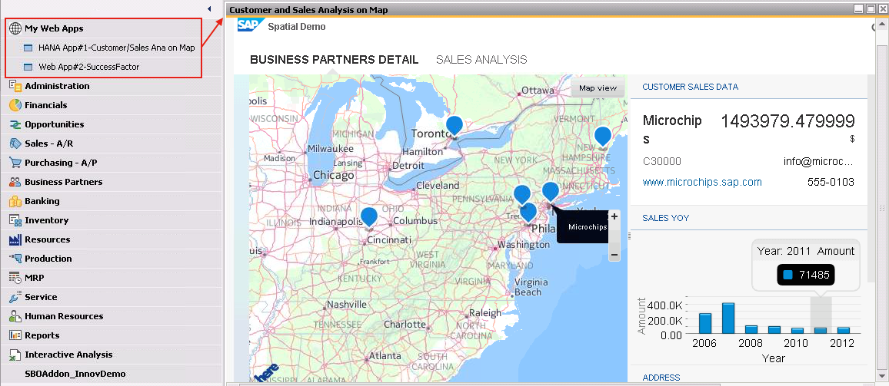

<!--- Register repository https://api.reuse.software/register, then add REUSE badge:

-->

# B1xAppContainerAddOn - Embedding SAP HANA App or Any other Web App into SAP Business One
This generic tool(Add-On) enable you to embed an web application into SAP Business One for seamless integration of your web application and SAP Business One on user interface. Please refer to [this blog post](https://blogs.sap.com/2015/12/07/embedding-sap-hana-app-or-any-other-web-app-into-sap-business-one/) for details.

## Download and Installation
Please refer to [this blog post](https://blogs.sap.com/2015/12/07/embedding-sap-hana-app-or-any-other-web-app-into-sap-business-one/) for details
* Download the source code by clone this github repository.
* Customize menu item(s) in B1xAppContainerAddOn to open your multiple HANA app(s) or any other web app(s) in [B1xAppMenus.xml](src/B1xAppMenus.xml)
* (Optional)If you need to use Service Layer SSO through UI API, please uncomment [the line#59~67 of Menu.vb](src/Menu.vb) and specify your Service Layer Base URL. 
* Compile the project for Release.
* Package the Add-On with ExtensionPackage tool.
* Install the Add-On through Light-weight Add-On Manager of SAP Business One.

## How to obtain support
[Create an issue](https://github.com/YatseaLi/B1xAppContainerAddOn/issues) in this repository if you find a bug or have questions about the content.
 
For additional support, [ask a question in SAP Community](https://answers.sap.com/questions/ask.html).

## Contributing
If you wish to contribute code, offer fixes or improvements, please send a pull request. Due to legal reasons, contributors will be asked to accept a DCO when they create the first pull request to this project. This happens in an automated fashion during the submission process. SAP uses [the standard DCO text of the Linux Foundation](https://developercertificate.org/).

## License
Copyright (c) 2022 SAP SE or an SAP affiliate company. All rights reserved. This project is licensed under the Apache Software License, version 2.0 except as noted otherwise in the [LICENSE](LICENSES/Apache-2.0.txt) file.
